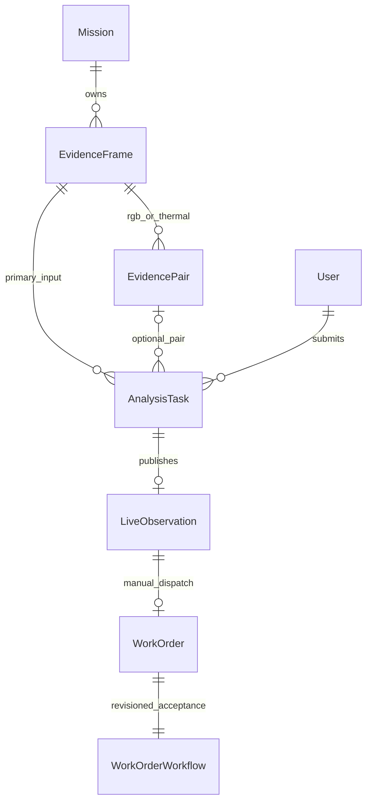

# 证据分析、双模态关联与工程闭环

本次改动为增量工程升级，保留原业务接口、热红外 v2 权重和人工复核派单流程。不是端到端 RGB-T 学习模型，不宣称平台已经达到生产认证或准确率全面提升。

## 实体与关系



- `EvidenceFrame`：不可编辑原始 JPEG/PNG 字节、SHA256、EXIF 纠正后的尺寸、任务 ID、通道和采样元数据。
- `EvidencePair`：两张帧的真实关联 ID、声明的配准记录。不能凭图片名称、同一上传时刻或相同尺寸推断同场景。
- `AnalysisTask`：提交者、输入摘要、幂等标识、配置、尝试次数、状态、租约和版本化输出。每次正式推理保留实际模型、参数、原图哈希、时长及失败原因。
- 成功任务生成 `LiveObservation`，复用已有人工位置核实、候选选择、执行/验收分离、原子派单、工单修订与验收流程。
- 不改变旧表列；启动时创建三个新增表。正式环境仍应建立受控数据库迁移及备份流程。上述关系并未替代完整的场站、组件资产或组织隔离模型。

## 两条数据路径

```text
视频源 → 浏览器取帧 → 1280px以内预览图 → preview(320px) → 临时候选
                       └ 同一瞬间的全分辨率取帧 → task(原生分辨率)
原始单图/配对图 → 字节/尺寸/元数据校验 → 不可变证据 → 持久化队列
→ 租约领取 → 单通道推理 → 配准/时间门控 → 空间关联或降级
→ 版本化结果/留档 → 人工复核 → 工单 → 验收/关闭 → 导出追溯
```

预览不入证据库、不创建工单、不积压旧采样。推理忙时返回 429 与 Retry-After，浏览器跳过并计数，五秒后恢复尝试；隐藏页面停止连续采样。原图上传不缩放；视频取帧仍是解码画面的 JPEG，不是相机 RAW 或辐射测温文件。正式输出才进入留档与复核路径。

这种区分参考了 [Ultralytics 官方推理参数与流缓冲说明](https://docs.ultralytics.com/modes/predict/)。并非所有配置越大越好，分辨率通过本地基准验证后决定。

## 分辨率验证与数据审计

固定热红外 v2 权重，先在验证集比较配置，冻结选择后再运行测试集；没有训练、改权重或依测试集调参。

| 验证配置 | mAP50 | mAP50–95 | CPU 批量推理 ms/图 |
| --- | ---: | ---: | ---: |
| 原生 416 | 0.6269 | 0.2824 | 7.22 |
| 预览 320 | 0.5574 | 0.2358 | 5.14 |
| 候选 640 | 0.5493 | 0.2619 | 14.66 |

640 未通过不回退门控，正式检测继续使用模型原生配置。416 测试集 mAP50 为 0.6767、mAP50–95 为 0.2821，与已有模型卡一致。320 更快但漏检风险更高，仅做临时预览。上述是本机批量模型时长，不等于网络请求耗时或设备端性能；首个 HTTP 任务还包含模型加载。

读取 1,428 张图，核验 JPEG/PNG 解码、像素哈希、YOLO 类别/有限数值/边界、类别分布、小框和空标注：无无效样本、无跨集合像素重复。训练集中 hotspot 2,498 / 3,463 框，且 2,945 框小于 32×32 面积；存在类别不均衡、小目标与邻近帧相关性风险。没有真实航次分组，因此 `captureGroupsVerified=false`。

审计工具可接收 `--groups` 的路径→真实采集组映射，阻断跨集合航次泄漏。不会自动修复标签、把未复核候选加入训练或把测试集混入训练。后续应先补真实航次、组件标识、校准记录与人工标注，再做训练集增强、类别采样及新场站盲测。

报告：`training_pipeline_v2/runs/analysis_profiles_20261005/profile-validation.json`、`dataset-audit.json`。工具只支持检测框数据目录，不宣称已经审计所有六类任务或近重复/标注语义。

## 融合策略与边界

本次实现的是**质量门控的空间证据关联**：

1. 同任务中的实际 RGB/热红外帧。完全相同文件不能冒充两种模态。
2. 两张帧必须声明设备采集时刻与共同设备时钟。浏览器时间或未知时间不能通过时间门控；绝对采集时间差不得超过 120ms。
3. 提供归一化 RGB→Thermal 单应矩阵、标定记录引用、声明的重投影 RMSE ≤3px；矩阵退化、存在投影极点时暂停融合。
4. 用 OpenCV 投影检测矩形四角，按真实凸多边形交并比计算；映射出界不静默裁剪。使用 SciPy 匈牙利匹配及虚拟空匹配，以 IoU≥0.2 做一对一关联；未匹配候选保留。
5. 不平均不同模型的分数，不把空间相邻视作同类故障。不同类别词表、原始分数与来源分别保留。
6. 信息缺失为 `held`，单通道执行失败为 `degraded`；另一通道结果仍可复核，全部失败才标为任务失败。

门限是本地策略默认值，需通过真实成对场景校验；用户声明的标定不是平台独立验证。RGB 不含温度，普通伪彩图也不是辐射测温证据。没有真实标定、时钟同步、视差处理或配对训练数据时，不能声称完成工程级融合诊断。单应矩阵主要适合近似平面，视差明显场景应另行标定与建模。[OpenCV 官方单应性说明](https://docs.opencv.org/4.x/d9/dab/tutorial_homography.html)

## 调度、容错与权限

- FIFO 单 CPU 工作线程。提交立即返回 202；每人最多 8 个活跃任务，全局最多 32 个，超限返回 429。幂等标识绑定用户及完整输入摘要，同标识改输入为 409。
- 数据库 compare-and-set 领取任务，120 秒租约，20 秒心跳。过期运行任务可恢复，最多三次执行；达到上限转失败。失败任务允许有界人工重试。
- `queued → running → succeeded / failed`；排队可直接取消，运行中为 `cancel_requested`，推理结束后取消。比较状态、令牌和有效租约，防止过期或被取消的工作提交晚到结果。
- 发布结果、留档关联、完成审计在同一事务；派单仍有独立的原子幂等保护。仅管理员/操作员能提交；管理员或原提交者可管理任务。
- 读权限沿用当前平台的已登录工作空间策略，不提供新组织/场站数据隔离。大文件采用每图 8MB、1600 万像素上限；仍需网关层总请求体、存储配额和保留期管理。
- 当前设计针对本地单 API 进程。进程内准入锁不是跨机器容量锁，旧推理接口仍使用各自模型锁；不宣称全平台 GPU 调度、严格实时 SLA 或分布式队列已完成。
- Python 线程不能强行终止原生推理。取消是协作取消；服务关闭停止领取并等待最多五秒，未完成任务靠租约恢复。生产规模或硬超时需求应使用隔离推理进程/专用队列与进程监督器，不能把守护线程当作进程隔离。[FastAPI 官方重计算任务边界](https://fastapi.tiangolo.com/tutorial/background-tasks/)

## 延迟与交互

分别显示浏览器采样时间、帧龄、HTTP 往返、服务推理、队列等待、任务处理和 HLS 播放距缓存末端。首次执行显示排队耗时；重试/重启恢复时显示“提交至本次启动”，包含先前执行及恢复等待，不冒充净排队耗时。没有可靠设备时钟时单程网络延迟为未知；缓存距离也不是从拍摄到播放的完整端到端延迟。

新增“证据分析队列”，有实际状态、取消/重试、配对上传、质量阻断原因、原图上的真实框、模型候选、来源哈希和 JSON 导出。使用既有语义色与浅/深主题，手机表格横向滚动，结果区单列；不以演示数字补齐缺失条件。已生成工单的结果进入工单详情，未派单进入人工复核。

## 复现与验收

```sh
cd backend
../.venv/bin/python -m unittest discover -s tests
cd ..
node scripts/test-api-session.cjs
cd frontend
npm run build
```

真实闭环验证用 `scripts/smoke-analysis-pipeline.py`。它仅允许 localhost，**会创建标记为测试的任务与工单**，仅应运行在隔离的演示数据库。本次预览使用 `/private/tmp/sentinel-upgrade-preview-20261004.db`，未修改原业务数据库。

本轮验证：95 个后端测试、5 个 API 会话测试、前端构建；实际原图提交→真实 v2 推理→5 个候选→人工复核接口派单→重复请求幂等→导出工单关联。浏览器文件选择器失效，文件上传已由真实 multipart HTTP 测试补验。浏览器另已跑通数据集测试视频→320px 快速预览→同一原始帧提交→正式检测完成；期间发现并修复 Python 3.9 的 UTC `Z` 时间戳兼容问题，实际中断任务也经租约恢复完成。页面浅/深色、手机结果与输入状态检查通过。

新界面：`http://127.0.0.1:5188/analysis`。模型权重 SHA256：`d7f7ecff0192fd9cbfb360926eecf8db38cfbb5e3359dc01d61bc3fbc2050ae2`，本轮保持不变。
